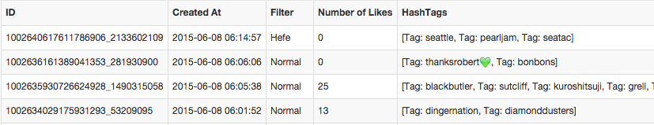
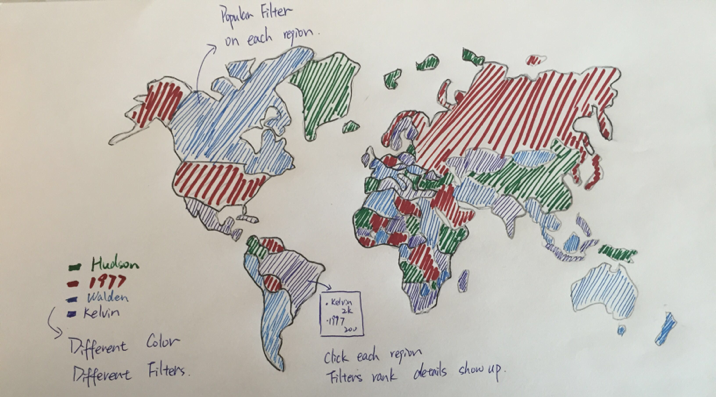
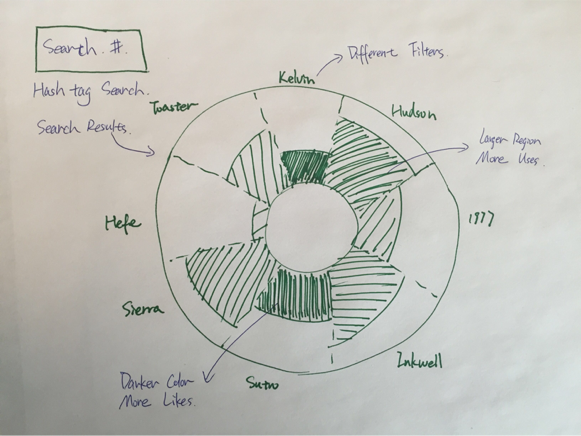

# fp-Heyl-xiaoyiz-yx1992
===============

## Team Members

1. Xin Yang yx1992@uw.edu
2. Yanling He Heyl@uw.edu
3. Xiaoyi Zhang xiaoyiz@uw.edu

## Project Name

Instagram Post Data Analysis

### Data set

Instagram API

### Description

This project is focusing on analyzing Instagram data to learn about the culture differences between different places. This project an- alyzes how filter usage are distributed in 50 cities, which are the cities with most population in each state of United States. This give us the information about how filter preference and vision culture varies in different states. The project also analyzes the number of hashtags been labeled on the posts for each city. It shows the popular hashtags for each city which reveal the popular event or hot terms in different cities. Our project also analyzes the Instagram filter data based on location and like to help you select better filters.

Interaction:

Location: user can click on dark blue dot, which is the city with largest population in a state. Then, the system shows the filter and tag visualization result based in the specific location. We want to use location as a filter for visualization results.

Filter: hovering on the chart shows filter visualization result. It lists the number of images using that filter and number of likes together with some sample images. This indicates the popularity of each filter.

Tags: clicking the city dot shows a words cloud with most popular tags shown up. This shows the average likes of photos using these tags.

## Running Instructions

Access our visualization at http://xiaoyizhang.me/fp/

OR

Clone the repo, run "python -m SimpleHTTPServer 8080" in the terminal under the repo directory.

Open browser and navigate to http://localhost:8080

## Story Board

Storyboard 1: There is a map for user to explore, different color indicate differnt most popular filter type indifferent countryies. When mouse click on that country, a window pop up showing the detail information of each filter being used in this country.

Storyboard 2: When user hit a country, a chart shows up with the filter usage details. Larger region means more posts and darker color means more likes for that filter on average. Also, if user input some hashtag, the filter result related to that hashtag shows as a new chart.

### Changes between Storyboard and the Final Implementation

During the implementation we found our initial design that using global map couldn't work out, since the location for the country is too broad and Instagram posts location information are stored as longitude and latitude, so we need to sample lots of data to get the most popular filter information for the country. And also not all the countries are using Instagram, in this case there will be too many countries are blank. So we change the map to US map and compare between the states.

In the final implementation, instead of allowing user to search the hashtag information to get the filter data, we implement a words cloud that showing most popular hashtags within that city. This is because when we analyze the hashtag information we got, we realize that sample we have does not have enough filter information, most tags only have one or two filters, in this case the comparsion of filters between different tags will be meaningless. So we change to show popular tags which can also reveal some popular event and social differences between cities.

## Development Process
Firstly, we browsed the available data sets and searched for interesting ones. For our interested data sets we try to come up a design with it and see if it works well. We select Instagram data sets, since Instagram is quite popular and we all use that. Xin processed the data to our desired data format. Based on the data selected, we design an interactive data visualization story board. Basically, it is an intractable US map with clickable city dots. Xiaoyi implement the map interaction function. After we got the interactive map works, Yanling changed the webpage and detail design. We did the presentation and writeup together. 

Yanling He: Design and implement the page layout, draw story board, presentation poster and writeup

Xiaoyi Zhang: Implement interactive map with PI chart and hovering functions, presentation and writeup

Xin Yang: Found data set and processing data, presentation and writeup

